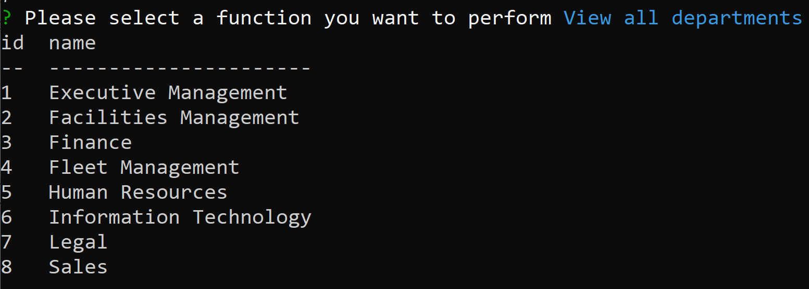
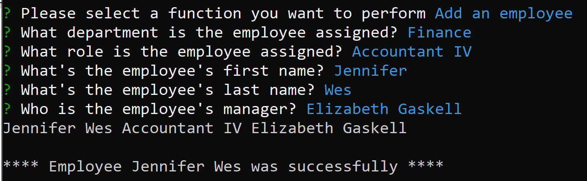

# [Employee Tracker](#title)

## [Description](#description)
Employee Tracker is an intuitive app that allows you to view and manage departments, roles, and employees within your company, simplifying business planning and organization task.

>> - Project Repository URL: https://github.com/bkfleet1/emp-tracker

>> - Walkthrough Video: https://watch.screencastify.com/v/GbEjblAJgbtTLYtwQFI0

## Table of Contents
> * [Title](#title)
> * [Description](#description)
> * [Developer](#developer)
> * [Resources](#resources)
> * [Installation](#installation) 
> * [Use Instructions](#usage)
> * [Tests](#tests)
> * [Questions](#questions)

## [Developer](#developer)
[Brad Kelley](mailto:bradkelleytech@gmail.com)

## [Resources](#resources)

The following resources were used in the development of this project.
> * MYSQL
> * Javascript
> * Node.js
> * NPM
> * Inquirer
> * Mysql2
> * Console.Table

## [Installation](#installation)
The following steps are required to execute the Employee Tracker code.

> 1. Clone the repository located at: https://github.com/bkfleet1/emp-tracker.
> 2. The application utilizes MYSQL a database. SQL queries have been provided to create the database (db.sql) and table schema (schema.sql), which you will find in the application's **db/** directory. The following steps can be followed to create the database;
>>> 1. Open a terminal application, such as git bash, and type "**mysql -u root -p**". Type in the password of your MYSQL root user;
>>> 2. Type "**source db/db.sql;**" and press enter to create the application's database;
>>> 3. Type "**source db/schema.sql;**" and press enter to create the application's database tables; and
>>> 3. Type "**quit;**" and press enter to exit MSQL.
>>> NOTE: If you do not have MYSQL, you can download it at https://www.mysql.com/downloads/.
> 3. Next you will need to open the **connection.js** file located in the application's **db/** directory and enter **user** and **password** credentials to connect to the **emp_tracker** database you created in Step 2.
> 4. Install Node.js. You can download the latest version of Node.js at https://nodejs.org/en/ ;
> 5. Open the project in a terminal application, such as git bash, and install NPM. To install npm, simply type "**npm install**" and press enter. Don't close your terminal application, we have a couple more items to install;
> 6. Next install Inquirer, which is a package that enables the question prompts used to populate your readme.md file that will be generated. To install Inquirer simply type "**npm install inquirer**" and press enter;
> 7. Next install MYSQL2, which is a package that enables communication with your MYSQL database. To install MYSQL2 simply type "**npm install mysql2**" and press enter;
> 8. Finally you will need to install console.table, which visualizes data in tables. You can install this package by typing "**npm install console.table**" and press enter.

**NOTE: If you are familiar with SQL quieries, you can modify the db/db.seeds.sql file to pre-populate the application's databse with your company's data.**

## [Use Instructions](#usage)
After the installation process, you are ready to run the application. Just open the project in a terminal application, such as git bash, and type "**node index**" and press enter. The application will present you with a feature menu that allows you to view and create departments, roles, and employee profiles, as well as the ability to update an employee's title. The image below illustrates the application's feature menu.

>> - Select **View all departments** to view all departments in the application's department table. The image below illustrates this function.

>> - Select **View all roles** to view all roles in the application's role table. The image below illustrates this function.

>> - Select **View all employees** to view all roles in the application's employee table. The image below illustrates this function.

>> - Select **Add a department** to add a new department to the application's department table. The image below illustrates this function.

>> - Select **Add a role** to add a new role to the application's role table. Note that each role is unique to a department and therefore you must identify the department for which the role applies. The image below illustrates this function.

>> - Select **Add an employee** to add a new employee to the application's employee table. Note that an employee is assigned to a department and therefore you must identify the department to which the the employee belongs. The image below illustrates this function.

>> - Select **Update an employee role** to update an employee's role. Note that an employee is assigned to a department and therefore you must identify the department to which the the employee belongs. The image below illustrates this function.

## [Tests](#tests)
No formal testing is available. However, test data is provided in the **db/seeds.sql** file, which can be invoked using the following steps. 

**NOTE: Your testing environment should be different from the production environment described in the [Installation](#installation) section. You can create a test environment following [Installation](#installation) instructions, but you will need to modify the database name in the **db/db.sql** file and the **db/connection.js** file to use your desired test database name.**

>>> 1. Open a terminal application, such as git bash, and type "**mysql -u root -p**". Type in the password of your MYSQL root user;
>>> 2. Type "**use database YOUR_TEST_DATABASE_NAME;**" and press enter. 
>>> 3. Type "**source db/db.seeds.sql;**" and press enter to populate the database with sample data for testing purposes;
>>> 4. Type "**quit;**" and press enter to exit MSQL.

## [Questions](#questions)
Please email [Brad Kelley](mailto:bradkelleytech@gmail.com) with any project questions.

